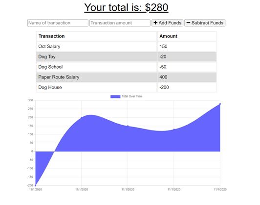

# every-last-penny

An app to track your financial transactions and compile stats on your overall budget.

## Installation

This application requires the Mongoose, Express, Compression, Lite-Server, and Morgan modules.  The data is stored using a MongoDB database, with a single Transaction model.  The app is a PWA with a manifest and service worker.

The express server is started using the server.js file.

## Usage 

The application is deployed to: https://immense-escarpment-71650.herokuapp.com/ 

The user only sees a main budget page.  The screen allows users to enter items into the database, which have a name and a price.  The user then selects if the item is an addition or subtraction from the current funds.  Once selected, the budget and accompanying chart is updated.  The app has IndexedDB functionality, so if the app goes offline it will save whatever transactions are entered and upload the data to the database when online.

-----

Below is screenshot of the app interface.

## Credits

Created by: Christopher Cruzcosa

## License

Copyright (c) [2020] [Christopher Cruzcosa]

Permission is hereby granted, free of charge, to any person obtaining a copy
of this software and associated documentation files (the "Software"), to deal
in the Software without restriction, including without limitation the rights
to use, copy, modify, merge, publish, distribute, sublicense, and/or sell
copies of the Software, and to permit persons to whom the Software is
furnished to do so, subject to the following conditions:

The above copyright notice and this permission notice shall be included in all
copies or substantial portions of the Software.

THE SOFTWARE IS PROVIDED "AS IS", WITHOUT WARRANTY OF ANY KIND, EXPRESS OR
IMPLIED, INCLUDING BUT NOT LIMITED TO THE WARRANTIES OF MERCHANTABILITY,
FITNESS FOR A PARTICULAR PURPOSE AND NONINFRINGEMENT. IN NO EVENT SHALL THE
AUTHORS OR COPYRIGHT HOLDERS BE LIABLE FOR ANY CLAIM, DAMAGES OR OTHER
LIABILITY, WHETHER IN AN ACTION OF CONTRACT, TORT OR OTHERWISE, ARISING FROM,
OUT OF OR IN CONNECTION WITH THE SOFTWARE OR THE USE OR OTHER DEALINGS IN THE
SOFTWARE.